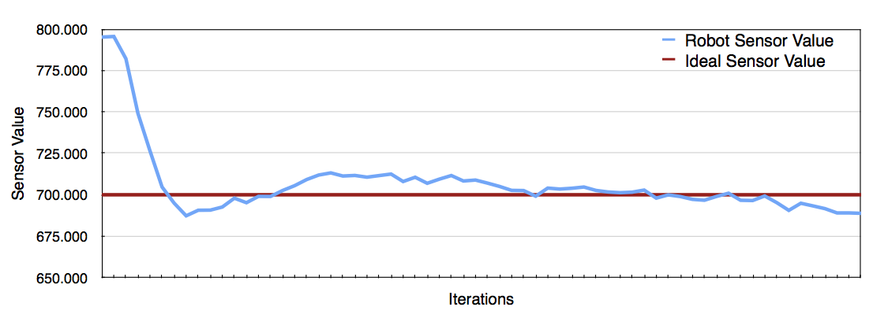

Introduction to Vision and Robotics 2014
======

*Mark Nemec, Milan Pavlik*

*s1140740, s1115104*


# 1 Introduction

## 1.1 The Task

The idea of the task is to design an algorithm to allow a Kephera robot to move through an environment while maintaining relatively constant distance from the walls and obstacles. The environment consists of a room with obstacles (boxes). The robot is required to carefully drive around the obstacles without hitting them. The robot continues following the walls until another obstacle is found.

The task is divided into two sections, in the first the robot is not required to stop at any point and keeps on driving around the room indefinitely. This is similar to a vacuum cleaner robot used in households. The second task is comparable to a surveillance robot where the robot traces around the walls, maintaining constant distance and avoiding obstacles, but it is required to stop when it completes a lap. It should be stopped on the same spot where it originally started.

The Kephera robot has two motors on each side of the robot as well as eight sensor positioned around the robot. The sensors can be used to retrieve the distances of objects around the robot.


## 1.2 Main Ideas

The main ideas used in the implementation are the following: *following a wall*, *avoiding obstacles* and *returning to the home location*.

Following a wall is based on the concept of a *Proportional Integral Derivative* (PID) controller where ideal situations are established and deviations from the ideal position are corrected for. Additionally, to the proportional error function, we also use the integral error (or cumulative error function) to influence the amount by which we correct for the ideal position error to speed the process. In essence, we do not use all the three parts of PID as the derivative component was not necessary.

In order to avoid obstacles in the path, we switch a *rotate* mode where the wheels of the robot are set to rotate on the spot. The *rotate* mode is exited when the sensor provide sufficient evidence of having rotated enough. In the next stage the PID controller is restarted and following a wall is resumed.

Returning to the home location is done through relative odometry calculations. Initially, the relative location of the robot is zero and every action updates the internal representation of position. As the robot approaches its home location, the relative location will be approaching zero and the robot stops.


#2 Methods

## 2.1 PI Controller

The PI Controller is based on proportional error from an optimal point and factors in the cumulative error of previous actions.

Firstly, we select a set point `set_point` which represents the ideal reading of a sensor. Secondly, we compute the proportional part of the PI controller, to do this we find the offset of the current reading `current_reading` from the ideal value. Finally, we use a value of gain, `p_gain` to fine tune the proportional component.

`proportional = (set_point - current_reading) * p_gain`

Secondly, we keep track of the cumulative error function, that is the past errors and their corrections. The error function allows us to influence the action that needs to be executed next. For example, if the error is high, the turn action executed next should be faster than if the error were low. The current error can be computed similarly to the *proportional* component. Initially, we find the offset and multiply by integral gain constant `i_gain`.

`integral = (set_point - current_reading) * i_gain`

Next, the cumulative error is updated with the value of the *integral* component.

`c_error = c_error + integral`

Finally, the return value of the PI Controller becomes the sum of the cumulative error and the proportional.

`pi = propotional + c_error`

The resulting action will be stronger if the error is high and vice versa. The actions will eventually stabilize in an equilibrium until an obstacle or non-straight line object is found.

## 2.2 Wall following

Wall following is done using only one sensor, namely the sensor located at three o'clock of the robot. The robot only rotates one way and follows the wall on its right hand side.

Firstly, we obtain the distance readings from the sensors. The readings are saved into a list of `sensor_values`.
```
for i = 1 : SENSOR_COUNT
    sensor_values(i) = wb_distance_sensor_get_value(ps(i));
end
```

Secondly, we calculate the PID value of the sensor located at three o'clock of the robot given the ideal distance from the wall `distance_thresh`, the proportional gain `P_GAIN` and the cumulative error gain `I_GAIN`. We also supply the current cumulative error value in order to update it inside the *pid* function.

```[motors_pid, errors] = pid(sensor_values(6), distance_thresh, P_GAIN, I_GAIN, errors);```

Thirdly, the speed on the right motor `vright` is calculated as the capped value of the `motors_pid` result between -10 and 10. The capping is important to be maintain reasonable speeds in situations where the cumulative error is large and the distance from the ideal position is large too. We take the negative value of the `motors_pid` value to reverse the relationship between sensor readings and actual distance. The implementation of Kephera returns large sensor readings when the robot is close while small values when it is far away.

```vright = clamp(-motors_pid, -10, 10);```

Next, we split the speed on the left motor and the right motor between total speed of 12. If the ideal speed is 6 on each motor when going straight, the distribution of speeds allows the robot to correct for non ideal distances from the wall.

For example, if the robot is far away from the wall and the sensor reads a value of 200, we will obtain a value smaller than 5 from `motors_pid`. This will result in the left motor getting a larger slice of the total speed and turn faster, brining the robot closer to the wall.

The distribution of speeds for each wheel is done with the following code:

```vleft = 12 - abs(vright);```

Finally, the motor speeds of the Kephera robot are updates:

```wb_differential_wheels_set_speed(vleft, vright);```


## 2.3 Obstacle Avoidance

Obstacle avoidance requires the PID results to be overridden as PID is not suitable for obstacle avoidance. When avoiding an obstacle, the controller switches into a `turning` mode where it will rotate on the spot to the left until the sensor readings indicate that a turn has been made and it is okay to switch back to line following mode. In the implementation, this is done with nested if statements.

### 2.3.1 Detecting obstacles
In order to detect an obstacle in front of the robot, we use two sensors located at the front of the robot. If an obstacle closer to a threshold is detected, the robot switches into *turn* mode, indicated by `is_turning` flag, and begins rotating left on the spot.

```
if sensor_values(4) > 670 & sensor_values(3) > 670
    is_turning = true;
    turn_distance = sensor_values(4);
    vleft = -3;
    vright = 3;
```

### 2.3.2 Rotations

When the robot is in the *turning* mode, the robot will keep rotating until the sensor located on the right hand side at two o'clock is below a threshold. The mode is switched back to *follow a line* and the errors collected for the PID are re-set.

```
if is_turning
    if sensor_values(5) <= 400
        is_turning = false;
        errors = 0;
        ...
    else
        vleft = -3;
        vright = 3;
    end
```

## 2.4 Odometry

# 3 Results

## 3.1 Distance Control



## 3.2 Obstacle Avoidance

## 3.3 Returning home

# 4 Discussion

## 4.1 Future Improvements
